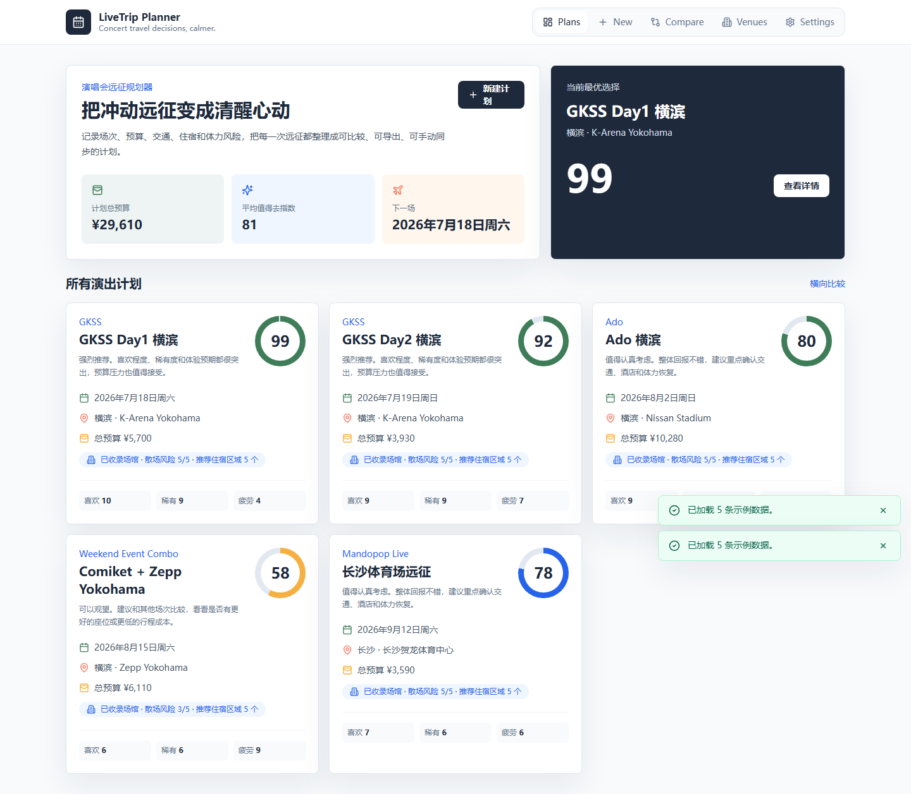
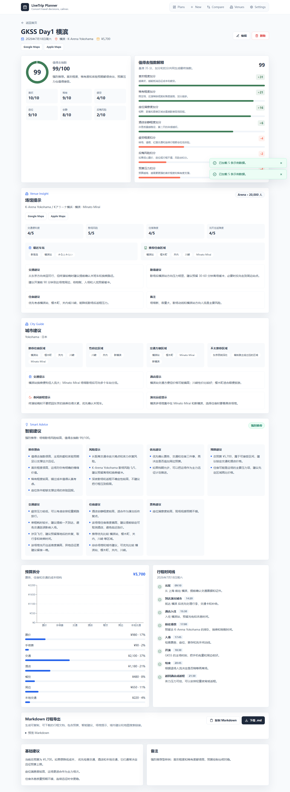
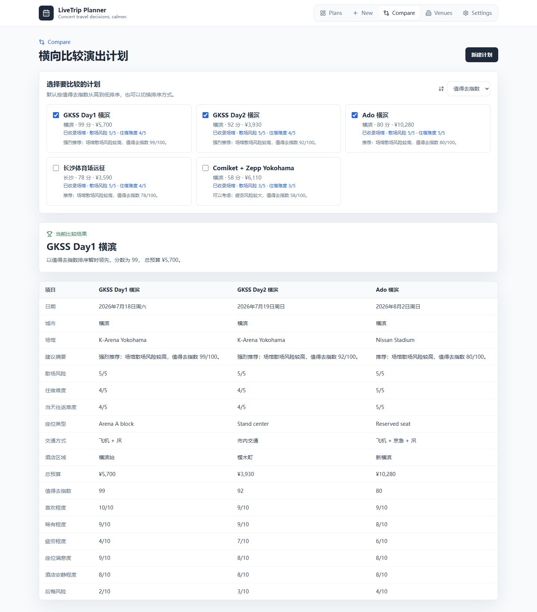
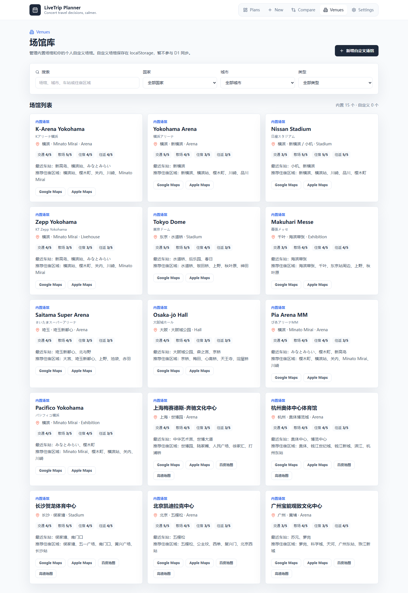
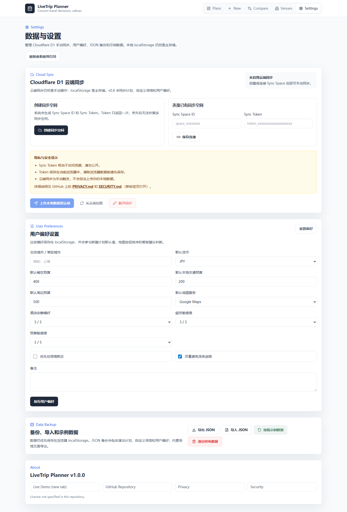

# LiveTrip Planner


LiveTrip Planner 是一个本地优先的演出远征规划器：把演唱会 / Live / 展会联动的预算、交通、住宿、场馆风险、城市建议和个人偏好整理成可比较、可导出、可手动云同步的决策工具。

Live Demo: https://livetrip-planner.pages.dev  
Tech Stack: React, TypeScript, Vite, Tailwind CSS, Cloudflare Pages Functions, Cloudflare D1, Vitest, Playwright

## 中文

### 项目解决的问题

演出远征决策通常不只是“想不想去”，还包括票价、手续费、交通、酒店、餐饮、周边、座位体验、疲劳、散场、住宿区域和后悔风险。LiveTrip Planner 将这些信息结构化，生成 Worth Score 和 Smart Advice，帮助用户更理性地比较多个计划。

### v1.0 功能概览

- Trip Plans：创建、编辑、删除和查看演出远征计划。
- Worth Score：0-100 值得去指数和评分拆解。
- Smart Advice Engine：规则驱动的预算、交通、住宿、票务、场馆、城市和偏好建议。
- Venue Library：内置场馆库、自定义场馆和场馆风险评分。
- City Guide：静态城市住宿区域、夜间返程和远征提示。
- User Preferences：常驻城市、默认预算、地图偏好和风险敏感度。
- Cloud Sync：匿名 Sync Space，手动同步 Trip Plans、自定义场馆和用户偏好。
- Export：Markdown 行程导出和 schema v1 JSON 备份。
- Compare：多计划排序比较。
- Product Polish：首次引导、Toast、Error Boundary、未保存修改保护、路由级代码拆分。
- Quality：Vitest 单元测试、Playwright E2E、GitHub Actions CI。

### 产品工作流程

1. 在 Dashboard 查看所有计划或加载示例数据。
2. 创建计划，填写演出、预算、交通、住宿、座位和偏好评分。
3. 在详情页查看预算图表、Worth Score、Smart Advice、时间线、场馆提示和城市建议。
4. 在 Compare 横向比较多个计划。
5. 在 Venues 维护个人自定义场馆知识库。
6. 在 Settings 配置用户偏好、JSON 备份、Cloud Sync 和隐私安全信息。

### 页面截图








### 技术架构

- Frontend: React + TypeScript + Vite
- Styling: Tailwind CSS
- Routing: React Router + `React.lazy`
- Charts: Recharts，按详情页异步加载
- Storage: localStorage 本地优先
- API: Cloudflare Pages Functions
- Database: Cloudflare D1
- Testing: Vitest + Playwright
- CI: GitHub Actions, Node.js 22

### 数据流与 Cloud Sync

本地数据优先写入浏览器 `localStorage`：

- `livetrip-planner:plans`
- `livetrip-planner:custom-venues`
- `livetrip-planner:user-preferences`
- `livetrip-planner:sync-credentials`

Cloud Sync 使用匿名 Sync Space，不做注册、登录、OAuth 或邮箱验证：

1. `POST /api/sync-spaces` 创建 `syncSpaceId` 和一次性 `syncToken`。
2. 服务端只保存 `syncToken` 的 SHA-256 hash。
3. `POST /api/sync/push` 手动上传 plans、customVenues、preferences。
4. `GET /api/sync/pull` 手动拉取云端数据。
5. 前端按 `updatedAt` 合并冲突；无法判断时优先保留本地版本。

D1 binding name: `DB`  
D1 database name: `live-trip-planner-db`

### JSON 备份格式

v1.0 正式定义备份格式：

```json
{
  "schemaVersion": 1,
  "appVersion": "1.0.0",
  "exportedAt": "ISO datetime",
  "tripPlans": [],
  "customVenues": [],
  "userPreferences": {}
}
```

旧版没有 `schemaVersion` 的备份会按 schema 0 兼容导入；未知更高版本会被拒绝并提示用户。

### 快速开始

```bash
npm install
npm run dev
```

构建：

```bash
npm run build
```

测试：

```bash
npm run test:run
npm run test:e2e:ci
```

生成截图：

```bash
npm run screenshots
```

### Cloudflare 部署

Cloudflare Pages:

- Build command: `npm run build`
- Build output directory: `dist`
- Pages Functions: `functions/api/[[route]].ts`
- D1 binding name: `DB`

D1 migrations:

```bash
wrangler d1 migrations apply live-trip-planner-db
```

### 隐私与安全设计

- 不需要账号、姓名或邮箱。
- 默认数据只保存在浏览器 localStorage。
- 用户点击上传时才会写入 Cloudflare D1。
- Sync Token 明文只保存在当前浏览器，服务端只保存 hash。
- Sync Token 丢失无法恢复，泄露后应创建新的 Sync Space。
- 外部地图按钮只生成搜索链接，不使用地图 API Key。

更多见 [PRIVACY.md](PRIVACY.md) 和 [SECURITY.md](SECURITY.md)。

### 已知限制

- 没有完整账号系统。
- Sync Token 丢失无法恢复。
- 云同步是手动同步，不是实时同步。
- 冲突合并依赖 `updatedAt`。
- 场馆库和 City Guide 是静态数据。
- 不提供实时交通、酒店、票务或汇率信息。
- 多币种只是显示偏好，没有实时汇率转换。
- Smart Advice 是规则系统，不是专业旅行建议。

### 项目结构

```text
src/
  components/        UI components
  data/              built-in venues and city guides
  lib/               advice, sync, preferences, custom venues
  pages/             route-level pages
  utils/             storage, backup, markdown, calculations
  __tests__/         Vitest unit tests
functions/api/       Cloudflare Pages Functions API
migrations/          Cloudflare D1 migrations
e2e/                 Playwright E2E and screenshot tests
docs/                architecture, screenshots, release notes
```

### 文档

- [Architecture](docs/ARCHITECTURE.md)
- [Release Notes v1.0](docs/RELEASE_NOTES_1.0.md)
- [Changelog](CHANGELOG.md)
- [Privacy](PRIVACY.md)
- [Security](SECURITY.md)

## English

LiveTrip Planner is a local-first concert travel planner for deciding whether an out-of-town live event is worth the budget, travel fatigue, venue risk, and accommodation complexity.

Live Demo: https://livetrip-planner.pages.dev

### Highlights

- Create, edit, delete, compare, and export trip plans.
- Calculate total budget and a 0-100 Worth Score.
- Rule-based Smart Advice Engine for budget, travel, hotel, ticket, venue, city, and preference signals.
- Built-in venue database plus user-managed custom venues.
- Static City Guide recommendations.
- Anonymous Sync Space cloud sync on Cloudflare D1.
- Versioned JSON backup format.
- First-run onboarding, toast feedback, error boundary, and unsaved-change protection.
- Vitest unit tests, Playwright E2E tests, and GitHub Actions CI.

### Architecture

- React + TypeScript + Vite
- Tailwind CSS
- React Router with route-level lazy loading
- Recharts loaded on the detail route
- localStorage as the primary data store
- Cloudflare Pages Functions for `/api/*`
- Cloudflare D1 with binding name `DB`

### Quick Start

```bash
npm install
npm run dev
npm run build
npm run test:run
npm run test:e2e:ci
```

### Cloudflare Pages

- Build command: `npm run build`
- Build output directory: `dist`
- D1 binding name: `DB`
- D1 database name: `live-trip-planner-db`

### Privacy and Security

No account, email, OAuth, AI API, map API, or real-time hotel/traffic API is required. Cloud Sync is manual. Sync Tokens are stored in the browser and only token hashes are stored server-side.

### Known Limitations

- No full account system.
- Lost Sync Tokens cannot be recovered.
- Sync is manual.
- Conflict resolution is based on `updatedAt`.
- Venue and City Guide data is static.
- No real-time traffic, hotel, ticketing, or exchange-rate data.
- Smart Advice is rule-based and not professional travel advice.
